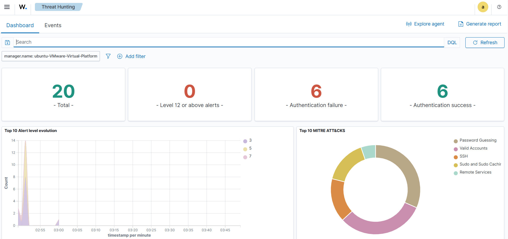
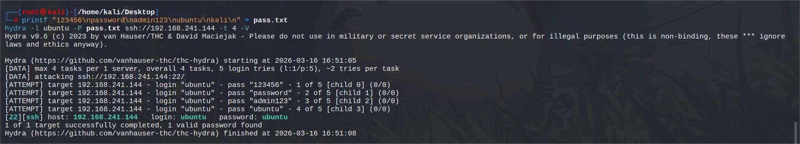
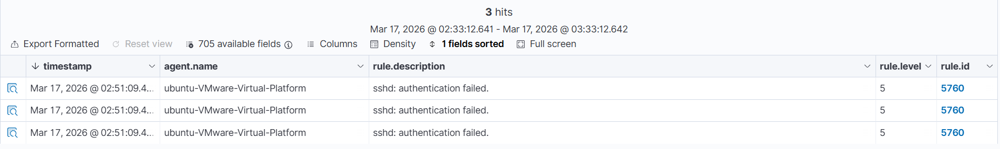
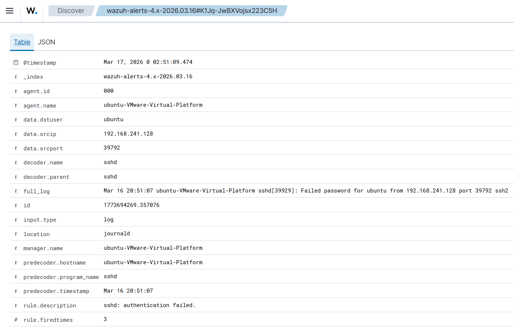
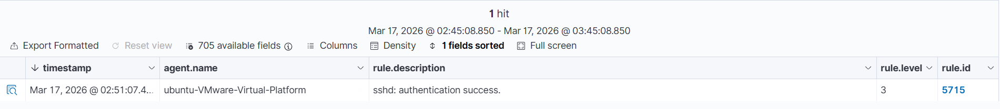
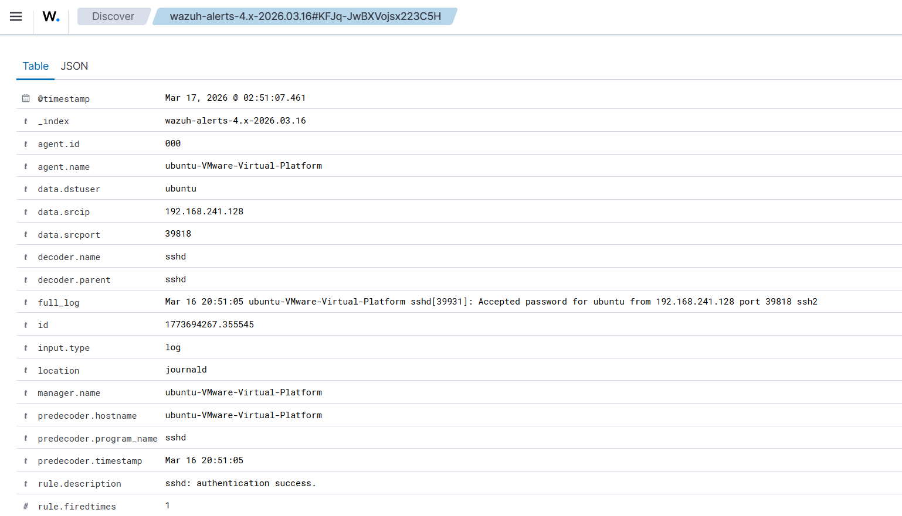

# AI-Enhanced SOC with Wazuh and ML Alert Enrichment

This project demonstrates a Security Operations Center workflow where Wazuh SIEM alerts are enriched by a Python-based machine learning integration. The goal is to classify alerts as `Benign` or `Attack` using a binary intrusion detection model trained on CICIDS2017 and exported with `joblib`.

## Project Summary

- **SIEM**: Wazuh manager on Ubuntu
- **Attacker node**: Kali Linux with Wazuh agent
- **Integration language**: Python
- **Model type**: Binary IDS (`Benign` vs `Attack`)
- **Model files**:
  - `binary_ids_model.pkl`
  - `binary_scaler.pkl`
  - `binary_feature_list.pkl`
- **Attack simulations completed**:
  - `nmap` scan
  - `hydra` SSH brute-force simulation

## Architecture

Kali Attack Simulation  
↓  
Ubuntu network / auth logs  
↓  
Wazuh SIEM alert generation  
↓  
Custom Python integration  
↓  
Model prediction (`Benign` / `Attack`)  
↓  
Enriched JSON output  
↓  
Dashboard / log evidence

## Repository Structure

```text
ml_wazuh_project/
├─ README.md
├─ LICENSE
├─ .gitignore
├─ binary_feature_list.pkl
├─ binary_ids_model.pkl
├─ binary_scaler.pkl
├─ feature_mapping.json
├─ ml_ids_integration.py
├─ feature_mapping.json.json
├─ docs/
│  ├─ architecture.md
│  ├─ setup-guide.md
│  ├─ rollback-guide.md
│  ├─ test-scenarios.md
│  └─ screenshots/
├─ scripts/
│  ├─ simulate_nmap.sh
│  ├─ simulate_hydra.sh
│  └─ watch_wazuh.sh
└─ examples/
   ├─ sample-enriched-attack.json
   └─ sample-enriched-benign.json
```

## What Was Built

- A custom Wazuh integration script that:
  - loads the model, scaler, and feature list
  - reads Wazuh alert JSON
  - extracts mapped features
  - scales input values
  - predicts `Benign` or `Attack`
  - writes enriched output to `/var/ossec/logs/integrations/ml_ids_predictions.json`
- A working Wazuh manager integration on Ubuntu
- Verified attack simulation from Kali to Ubuntu over SSH
- ML-enriched alert output generated automatically from Wazuh alerts

## Key Demo Result

The end-to-end pipeline was validated with Hydra SSH activity:

- Wazuh detected failed SSH authentication attempts
- Wazuh detected successful SSH authentication
- The custom ML integration processed those alerts automatically
- Enriched JSON output was written for each alert

## Evidence Walkthrough

### 1) Wazuh Dashboard Overview (Start Here)

This screenshot is the primary dashboard view and should be shown first.



### 2) Attack Simulation from Kali (Hydra)

Hydra was executed from Kali against Ubuntu SSH.



### 3) Failed SSH Authentication Detection (`rule.id = 5760`)

Wazuh detected failed SSH authentication attempts from the Kali source IP.




### 4) Successful SSH Authentication Detection (`rule.id = 5715`)

Wazuh detected successful SSH authentication after brute-force attempts.




### 5) ML Enrichment Output (Ubuntu)

The custom integration enriched Wazuh alerts and appended model output.


## Important Limitation

The current model was trained on CICIDS2017 flow-based features. Wazuh auth/syslog alerts do not expose most of those flow features directly, so the integration currently shows a high `missing_feature_count`. This does **not** break the integration, but it does limit the strength of the ML classification claim.

For a stronger future version, add:

- Suricata
- Zeek
- NetFlow/IPFIX
- or retrain the model on Wazuh-native features

## Quick Demo Steps

### On Ubuntu

```bash
sudo tail -f /var/ossec/logs/alerts/alerts.json
```

In another terminal:

```bash
sudo tail -f /var/ossec/logs/integrations/ml_ids_predictions.json
```

### On Kali

```bash
./scripts/simulate_nmap.sh 192.168.241.144
```

```bash
./scripts/simulate_hydra.sh 192.168.241.144 ubuntu
```

## Best Evidence to Show

- Hydra terminal output with failed attempts and discovered valid credentials
- Wazuh alert lines for:
  - `5760` (`sshd: authentication failed.`)
  - `5715` (`sshd: authentication success.`)
- Enriched JSON lines in `ml_ids_predictions.json`
- Wazuh dashboard screenshots for the same events

## Safety and Cleanup

- Use only in an isolated, authorized lab
- Change weak test credentials after the demo
- Back up `ossec.conf` before modifications
- Remove the integration block and restart Wazuh to restore the original state

## Interview Talking Points

- Built a custom Wazuh-to-ML enrichment pipeline
- Integrated Python inference into a live SOC monitoring workflow
- Simulated attacks from Kali and validated alert generation in Wazuh
- Produced enriched alert output suitable for dashboarding and incident triage
- Identified limitations between dataset feature space and SIEM-native event fields

## Next Improvements

- Add Suricata to capture network-layer evidence
- Forward enriched logs into Wazuh indexer for dashboard filtering
- Replace static mapping with a normalized feature transformation layer
- Retrain with telemetry that better matches real Wazuh alerts
